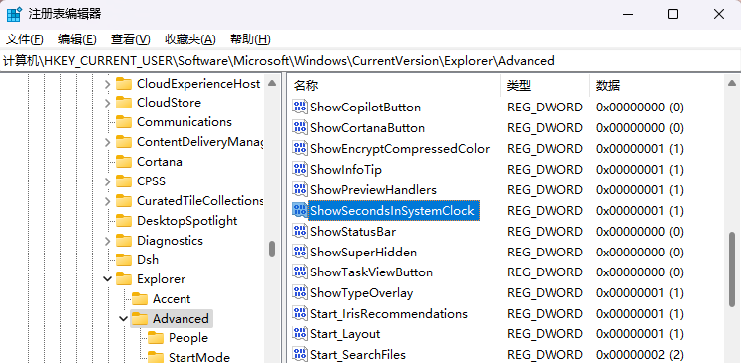
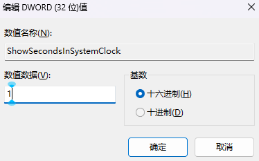

### 打开注册表

- win+R输入regedit打开注册表编辑器


### 找到路径

- 将下面的路径复制粘贴到地址栏中回车即可进入到指定目录

```code
计算机\HKEY_CURRENT_USER\Software\Microsoft\Windows\CurrentVersion\Explorer\Advanced
```



### 添加注册表选项

- 右键Advanced-新建-DWORD(32位)值，添加名为`ShowSecondsInSystemClock`的注册表项，并修改其值为1(如果已经有这个选项了直接修改值为1即可)


